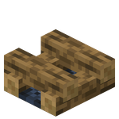

# Chiseled Campfire
Chiseled Campfire is a [block](../blocks.md) that can be produced by using a [Flint Chisel](../items/flint_chisel.md) or [Iron Chisel](../items/iron_chisel.md) on a wooden log of any type. It has the same properties as a regular [campfire](../blocks/campfire.md), but has a limited burn time.

  

  

When the block is set it will be unlit.

A lit chiseled campfire will burn out in 3 minutes and 10 seconds. The last 10 seconds it will emit more smoke particles, giving the player time to stoke the fire.
  

The burn time will reset if a stick is consumed by the campfire. A stick is consumed if dropped on top of the block or put to cook on the campfire.

  
	

  
<!-- TITLE -->  

(Unlit) Chiseled Campfire
  

<!-- IMAGE -->  

  
  

  

<!-- BASIC INFO -->  

  
<strong>Type:</strong> Block   

  
		
<!-- DIVIDER & INFO -->  

  

  
<strong>Obtainable as item:</strong> No 

  

  

### Usage
The Chiseled Campfire can be used the same way as the regular campfire and soul campfire. It can be used to cook items, burns entities standing on top of it, emits light and can serve as a source of heat to [freezing](../survival_systems/frost.md) players.
