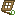

# Snare Trap
Snare Trap is a [block](../blocks.md) that can be used to catch wild Rabbits in the forest biome.

  

  

The block appears as a closed oak trapdoor, with a leaf texture over the top.

When placed in the forest biome, opened and surrounded by 4 grass blocks (north, south, west and east), an attempt to spawn a Rabbit will be made every 2.5 seconds. When succesfull, the block will be replaced with a closed oak trapdoor and a Rabbit will spawn in the trapdoor. (No Rabbits need to be nearby for this to succeed.)

  
	

  
<!-- TITLE -->  

Snare Trap (item)
  

<!-- IMAGE -->  

  
  

  

<!-- BASIC INFO -->  

  
<strong>Type:</strong> block   

  
		
<!-- DIVIDER & INFO -->  

  

  
<strong>Stackable:</strong> Yes 

  

  

### Obtaining

<table style="border-collapse: collapse; text-align: center; border: 2px solid #3a3a3a;">  
<!-- MERGED HEADER-->  
<tr>  
<th colspan="3" style="border: 2px solid #3a3a3a; background-color: #3a3a3a; color: white; padding: 6px; text-align: center;">Crafting Recipe (shapeless)</th>  
</tr>  
<!-- ROW 1 -->  
<tr>  
<td style="border: 1px solid #aaa;">Oak Trapdoor</td>  
<td style="border: 1px solid #aaa;">Stick</td>  
</tr>  
<!-- ROW 2 -->  
<tr>  
<td style="border: 1px solid #aaa;">Tall grass</td>  
<td style="border: 1px solid #aaa;"></td> 
</tr>  
</table>

