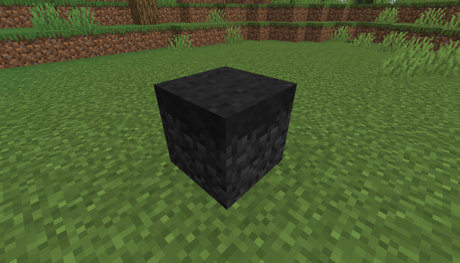

# Withered Soil
Withered Soil is a spreading [block](../blocks.md) that infects nearby terrain and can spawn wither skeletons.

  

  

The block appears as a nearly pitch-black version of the grass block.

It spreads over grass blocks and farmland. It spreads significantly faster during night.

It increases insanity of players standing on the block.

Wither skeletons spawn on withered soil.

Eventually it turns into soul soil.

  
	

  
<!-- TITLE -->  

Withered Soil
  

<!-- IMAGE -->  

  
  

  

<!-- BASIC INFO -->  

  
<strong>Type:</strong> block   

  
		
<!-- DIVIDER & INFO -->  

  

  
<strong>Stackable:</strong> Yes 

  

  

### Behavior
Standing by a withered soil block increases a players insanity over time (by +1 at a time).

Withered Soil spreads to nearby blocks in a 3×3 horizontal area and up to ±2 blocks vertically.
When spreading, it first converts valid blocks into Dormant variants. Dormant blocks will randomly convert into active Withered Soil over time.

Grass Blocks / Farmland are turned into dormant soil and eventually convert into Withered Soil.
Wooden Logs become dormant logs and eventually convert into dirt. When the logs turn into dirt, they also spread the infection to nearby logs.

After some time a wither skeleton block will turn into soul soil. 

#### Spawning
While the nearest player is within 24 to 128 blocks of a Withered Soil block there is a chance to spawn a wither skeleton (at any light level) as long as the two blocks above it are empty.
> Wither skeletons summoned this way do not carry a stone sword.

### Curing
If a lingering potion of regeneration or instant health is within 4 blocks of a withered soil block, the block will be replaced with a grass block and any dormant blocks will stop being dormant.

### Mining
When mined it will drop one brown dye. If mined with a shovel, a dirt block will drop instead. If the item used is enchanted with Silk Touch, a Withered Soil block will drop instead.

### Obtaining
Outside of placing the block, the only way to create Withered Soil is by becoming infected with the [Wither Virus](../miscellaneous/wither_virus.md). When a player carrying the Wither Virus stands over a grass block or farmland the block will become a dormant carrier and the player will lose the virus. 

