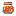

# Glistening Honey
Glistening Honey is a tool [item](../items.md) that can be used multiple times to grand Regeneration to the player.

  

  

Every time the item is used it grants the player Regeneration 2 effect for 4 seconds.

The texture of the item changes as the durability decreases.

  
	

  
<!-- TITLE -->  

Glistening Honey
  

<!-- IMAGE -->  

  
  

  

<!-- BASIC INFO -->  

  
<strong>Type:</strong> Tool   

  
		
<!-- DIVIDER & INFO -->  

  

  
<strong>Stackable:</strong> No 

  

<!-- DIVIDER & INFO -->  

  

  
<strong>Durability:</strong> 16 

  

  

### Obtaining

<table style="border-collapse: collapse; text-align: center; border: 2px solid #3a3a3a;">  
<!-- MERGED HEADER-->  
<tr>  
<th colspan="3" style="border: 2px solid #3a3a3a; background-color: #3a3a3a; color: white; padding: 6px; text-align: center;">Crafting Recipe</th>  
</tr>  
<!-- ROW 1 -->  
<tr>  
<td style="border: 1px solid #aaa;">Glass Pane</td>  
<td style="border: 1px solid #aaa;">Glass Pane</td>  
<td style="border: 1px solid #aaa;">Glass Pane</td>  
</tr>  
<!-- ROW 2 -->  
<tr>  
<td style="border: 1px solid #aaa;">Glistening Melon</td>  
<td style="border: 1px solid #aaa;">Honey Bottle</td>  
<td style="border: 1px solid #aaa;">Glistening Melon</td>  
</tr>  
<!-- ROW 3 -->  
<tr>  
<td style="border: 1px solid #aaa;">Glass Pane</td>  
<td style="border: 1px solid #aaa;">Glass Pane</td>  
<td style="border: 1px solid #aaa;">Glass Pane</td>  
</tr>  
</table>

