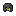

# Hydrating Helmet
Hydrating Helmet is an armor [item](../items.md) that passively increases the player's hydration score. It belongs to the [iron material tier](../material_tiers/iron_tier.md).

  

  

Hydrating Helmet passively hydrates the player, removing the need to maintain hydration manually.

Wearing a Hydrating Helmet also prevents rapid loss of hydration while on fire, standing in lava and while being in the Nether dimension.

  
	

  
<!-- TITLE -->  

Hydrating Helmet
  

<!-- IMAGE -->  

  
  

  

<!-- BASIC INFO -->  

  
<strong>Type:</strong> Armor   

  
		
<!-- DIVIDER & INFO -->  

  

  
<strong>Stackable:</strong> No 

  

<!-- DIVIDER & INFO -->  

  

  
<strong>Defense points:</strong> 2 

  

<!-- DIVIDER & INFO -->  

  

  
<strong>Durability:</strong> 165 

  

  

### Obtaining
The crafting recipe produces 1 Hydrating Helmet:

<table style="border-collapse: collapse; text-align: center; border: 2px solid #3a3a3a;">  
<!-- MERGED HEADER-->  
<tr>  
<th colspan="3" style="border: 2px solid #3a3a3a; background-color: #3a3a3a; color: white; padding: 6px; text-align: center;">Crafting Recipe</th>  
</tr>  
<!-- ROW 1 -->  
<tr>  
<td style="border: 1px solid #aaa;">iron_ingot</td>  
<td style="border: 1px solid #aaa;">iron_ingot</td>  
<td style="border: 1px solid #aaa;">iron_ingot</td>  
</tr>  
<!-- ROW 2 -->  
<tr>  
<td style="border: 1px solid #aaa;">bucket</td>  
<td style="border: 1px solid #aaa;">wet sponge</td>  
<td style="border: 1px solid #aaa;">bucket</td>  
</tr> 
</table>

### Usage
While the base Hydrating Helmet does not offer strong protection, it can be combined with other helmets to give them its effects.

A Hydrating version of the Turtle, Golden, Blaze Gold, Steel, Diamond and Netherite Helmets can be made by cropping the helmet and Hydrating Helmet items on top of a Smithing Table.
Doing so will play a sound and particles, consume the Hydrating Helmet, change the name and appearance of the helmet to its Hydrating version and give it the same hydrating properties described above.

The hydrating helmets retain their previous armor points, armor tougness and enchantments. 

| Helmet type                 | Texture                                                                                                                                                                                 |
| --------------------------- | --------------------------------------------------------------------------------------------------------------------------------------------------------------------------------------- |
| Turtle hydrating helmet     | 
      
       |
| Golden hydrating helmet     | 
      
       |
| Blaze gold hydrating helmet | 
      
         |
| Diamond hydrating helmet    | 
      
     |
| Netherite hydrating helmet  | 
      
 |
