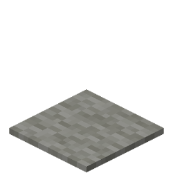

# Mattress
Mattress is a material [item](../items.md) that can be used to craft beds.

  

  

A Mattress is actually just a renamed gray carpet.

  
	

  
<!-- TITLE -->  

Mattress
  

<!-- IMAGE -->  

  
  

  

<!-- BASIC INFO -->  

  
<strong>Type:</strong> Material   

  
		
<!-- DIVIDER & INFO -->  

  

  
<strong>Stackable:</strong> Yes 

  

  

### Obtaining
A Mattress can be made by a master Shephard Villager if a [Mattress Materials](../items/mattress_materials.md) item is next to it. When the item is in close proximity to the Villager, the Villager will consume the item, pause and drop a Mattress after a few seconds.

It is also sometimes sold by Shepherd Villagers. 
> (They use the loom as their work station.)