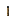

# Unlit Torch
Unlit Torch is a tool [item](../items.md) that can be used to obtain a [Lit Torch](../items/lit_torch.md), which can then be placed in the world as a torch block.

  

  

An unlit torch cannot be placed as a block and does not emit light. It has a durability bar which indicates how much longer it can burn for, when turned into a lit torch.

  
	

  
<!-- TITLE -->  

Unlit Torch
  

<!-- IMAGE -->  

  
  

  

<!-- BASIC INFO -->  

  
<strong>Type:</strong> Tool   

  
		
<!-- DIVIDER & INFO -->  

  

  
<strong>Stackable:</strong> No 

  

<!-- DIVIDER & INFO -->  

  

  
<strong>Durability:</strong> 100 

  

  

### Obtaining
The crafting recipe produces 1 Unlit Torch:

<table style="border-collapse: collapse; text-align: center; border: 2px solid #3a3a3a;">  
<!-- MERGED HEADER-->  
<tr>  
<th colspan="3" style="border: 2px solid #3a3a3a; background-color: #3a3a3a; color: white; padding: 6px; text-align: center;">Crafting Recipe</th>
</tr>  
<!-- ROW 1 -->  
<tr>  
<td style="border: 1px solid #aaa;">Coal</td>
</tr>  
<!-- ROW 2 -->  
<tr>  
<td style="border: 1px solid #aaa;">Stick</td>
</tr>
</table>

A Lit torch will turn into an unlit torch if the player is holding it while submerged in water.

### Usage
An unlit torch can be turned into a [Lit Torch](../items/lit_torch.md) by using it (right clicking) on a block that is a fire source:
- Lava
- Fire
- Lit campfire or soul campfire
- Torch or soul torch block