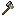

# Flint Tier
Flint tier is a [material tier](../material_tiers/list.md), that refers to the collection of tool [items](../items.md) made from Flint.
It is weaker than [Copper Tier](../material_tiers/copper_tier.md).
> The Flint Hatchet is based on the Vanilla wooden axe and shares its properties, except for durability.

| [Flint Chisel](../items/flint_chisel.md)                                                                                                                    | [Flint Hatchet](../items/flint_hatchet.md)                                                                                                                    |
| ----------------------------------------------------------------------------------------------------------------------------------------------------------- | ------------------------------------------------------------------------------------------------------------------------------------------------------------- |
| 
      
 | 
      
 |
| Durability: 100                                                                                                                                             | Durability: 10                                                                                                                                                |

### Obtaining
Flint chisel:

<table style="border-collapse: collapse; text-align: center; border: 2px solid #3a3a3a;">  
<!-- MERGED HEADER-->  
<tr>  
<th colspan="3" style="border: 2px solid #3a3a3a; background-color: #3a3a3a; color: white; padding: 6px; text-align: center;">Crafting Recipe (shapeless)</th>  
</tr>  
<!-- ROW 1 -->  
<tr>  
<td style="border: 1px solid #aaa;">Flint</td>  
<td style="border: 1px solid #aaa;">Stick</td>  
</tr>  
<!-- ROW 2 -->  
<tr>  
<td style="border: 1px solid #aaa;">String or Tall grass</td>  
<td style="border: 1px solid #aaa;"></td>
</tr>
</table>

Flint Hatchet:

<table style="border-collapse: collapse; text-align: center; border: 2px solid #3a3a3a;">  
<!-- MERGED HEADER-->  
<tr>  
<th colspan="3" style="border: 2px solid #3a3a3a; background-color: #3a3a3a; color: white; padding: 6px; text-align: center;">Crafting Recipe</th>  
</tr>  
<!-- ROW 1 -->  
<tr>  
<td style="border: 1px solid #aaa;">Flint</td>  
<td style="border: 1px solid #aaa;">Cobblestone</td>  
</tr>  
<!-- ROW 2 -->  
<tr>  
<td style="border: 1px solid #aaa;">String or Tall grass</td>  
<td style="border: 1px solid #aaa;">Stick</td>
</tr>
</table>
