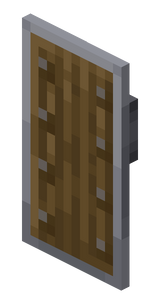

# Iron Tier
Iron tier is a [material tier](../material_tiers/list.md), that refers to the collection of tool and armor piece [items](../items.md) made from iron.
It is stronger than [Copper Tier](../material_tiers/copper_tier.md) and weaker than [Steel Tier](../material_tiers/steel_tier.md).
> The vanilla iron armor set has been removed. (Replaced by Steel armor.)
> The iron tools in Ultra Hardcore are actually retextured stone tools.

The Iron Pickaxe cannot be used to mine deepslate and deepslate ores.

The attack damage of the Iron Sword is 5 (equivalent to Vanilla Minecraft Stone Sword).

| Iron Sword                                                                                                                                               | Iron Pickaxe                                                                                                                                                 | Iron Axe                                                                                                                                             | Iron Shovel                                                                                                                                                | Iron Hoe                                                                                                                                             | [Iron Chisel](../items/iron_chisel.md)                                                                                                                    | (Iron) Shield                                                                                                                                   |
| -------------------------------------------------------------------------------------------------------------------------------------------------------- | ------------------------------------------------------------------------------------------------------------------------------------------------------------ | ---------------------------------------------------------------------------------------------------------------------------------------------------- | ---------------------------------------------------------------------------------------------------------------------------------------------------------- | ---------------------------------------------------------------------------------------------------------------------------------------------------- | --------------------------------------------------------------------------------------------------------------------------------------------------------- | ----------------------------------------------------------------------------------------------------------------------------------------------- |
| 
      
 | 
      
 | 
      
 | 
      
 | 
      
 | 
      
 | 
      
 |
| Durability: 250                                                                                                                                          | Durability: 250                                                                                                                                              | Durability: 250                                                                                                                                      | Durability: 250                                                                                                                                            | Durability: 250                                                                                                                                      | Durability: 500                                                                                                                                           | Durability: 336                                                                                                                                 |

| Chainmail Helmet                                                                                                                                                    | Chainmail Chestplate                                                                                                                                                        | Chainmail Leggings                                                                                                                                                      | Chainmail Boots                                                                                                                                                   | [Hydrating Helmet](../items/hydrating_helmet.md)                                                                                                                    |
| ------------------------------------------------------------------------------------------------------------------------------------------------------------------- | --------------------------------------------------------------------------------------------------------------------------------------------------------------------------- | ----------------------------------------------------------------------------------------------------------------------------------------------------------------------- | ----------------------------------------------------------------------------------------------------------------------------------------------------------------- | ------------------------------------------------------------------------------------------------------------------------------------------------------------------- |
| 
      
 | 
      
 | 
      
 | 
      
 | 
      
 |
| Durability: 165                                                                                                                                                     | Durability: 240                                                                                                                                                             | Durability: 225                                                                                                                                                         | Durability: 195                                                                                                                                                   | Durability: 165                                                                                                                                                     |
| Armor: 2                                                                                                                                                            | Armor: 4                                                                                                                                                                    | Armor: 3                                                                                                                                                                | Armor: 1                                                                                                                                                          | Armor: 2                                                                                                                                                            |
| Armor Toughness: 0                                                                                                                                                  | Armor Toughness: 0                                                                                                                                                          | Armor Toughness: 0                                                                                                                                                      | Armor Toughness: 0                                                                                                                                                | Armor Toughness: 0                                                                                                                                                  |

### Obtaining
Iron Axe:

<table style="border-collapse: collapse; text-align: center; border: 2px solid #3a3a3a;">  
<!-- MERGED HEADER-->  
<tr>  
<th colspan="3" style="border: 2px solid #3a3a3a; background-color: #3a3a3a; color: white; padding: 6px; text-align: center;">Crafting Recipe</th>  
</tr>  
<!-- ROW 1 -->  
<tr>  
<td style="border: 1px solid #aaa;">Iron Ingot</td>  
<td style="border: 1px solid #aaa;">Iron Ingot</td>  
<td style="border: 1px solid #aaa;"></td>  
</tr>  
<!-- ROW 2 -->  
<tr>  
<td style="border: 1px solid #aaa;">Iron Ingot</td>  
<td style="border: 1px solid #aaa;">Stick</td>  
<td style="border: 1px solid #aaa;"></td>  
</tr>  
<!-- ROW 3 -->  
<tr>  
<td style="border: 1px solid #aaa;"></td>  
<td style="border: 1px solid #aaa;">Stick</td>  
<td style="border: 1px solid #aaa;"></td>  
</tr>  
</table>

Iron Pickaxe:

<table style="border-collapse: collapse; text-align: center; border: 2px solid #3a3a3a;">  
<!-- MERGED HEADER-->  
<tr>  
<th colspan="3" style="border: 2px solid #3a3a3a; background-color: #3a3a3a; color: white; padding: 6px; text-align: center;">Crafting Recipe</th>  
</tr>  
<!-- ROW 1 -->  
<tr>  
<td style="border: 1px solid #aaa;">Iron Ingot</td>  
<td style="border: 1px solid #aaa;">Iron Ingot</td>  
<td style="border: 1px solid #aaa;">Iron Ingot</td>  
</tr>  
<!-- ROW 2 -->  
<tr>  
<td style="border: 1px solid #aaa;"></td>  
<td style="border: 1px solid #aaa;">Stick</td>  
<td style="border: 1px solid #aaa;"></td>  
</tr>  
<!-- ROW 3 -->  
<tr>  
<td style="border: 1px solid #aaa;"></td>  
<td style="border: 1px solid #aaa;">Stick</td>  
<td style="border: 1px solid #aaa;"></td>  
</tr>  
</table>

Iron Hoe:

<table style="border-collapse: collapse; text-align: center; border: 2px solid #3a3a3a;">  
<!-- MERGED HEADER-->  
<tr>  
<th colspan="3" style="border: 2px solid #3a3a3a; background-color: #3a3a3a; color: white; padding: 6px; text-align: center;">Crafting Recipe</th>  
</tr>  
<!-- ROW 1 -->  
<tr>  
<td style="border: 1px solid #aaa;">Iron Ingot</td>  
<td style="border: 1px solid #aaa;">Iron Ingot</td>  
<td style="border: 1px solid #aaa;"></td>  
</tr>  
<!-- ROW 2 -->  
<tr>  
<td style="border: 1px solid #aaa;"></td>  
<td style="border: 1px solid #aaa;">Stick</td>  
<td style="border: 1px solid #aaa;"></td>  
</tr>  
<!-- ROW 3 -->  
<tr>  
<td style="border: 1px solid #aaa;"></td>  
<td style="border: 1px solid #aaa;">Stick</td>  
<td style="border: 1px solid #aaa;"></td>  
</tr>  
</table>

Iron Shovel:

<table style="border-collapse: collapse; text-align: center; border: 2px solid #3a3a3a;">  
<!-- MERGED HEADER-->  
<tr>  
<th colspan="3" style="border: 2px solid #3a3a3a; background-color: #3a3a3a; color: white; padding: 6px; text-align: center;">Crafting Recipe</th>  
</tr>  
<!-- ROW 1 -->  
<tr>  
<td style="border: 1px solid #aaa;"></td>  
<td style="border: 1px solid #aaa;">Iron Ingot</td>  
<td style="border: 1px solid #aaa;"></td>  
</tr>  
<!-- ROW 2 -->  
<tr>  
<td style="border: 1px solid #aaa;"></td>  
<td style="border: 1px solid #aaa;">Stick</td>  
<td style="border: 1px solid #aaa;"></td>  
</tr>  
<!-- ROW 3 -->  
<tr>  
<td style="border: 1px solid #aaa;"></td>  
<td style="border: 1px solid #aaa;">Stick</td>  
<td style="border: 1px solid #aaa;"></td>  
</tr>  
</table>

Iron Chisel:

<table style="border-collapse: collapse; text-align: center; border: 2px solid #3a3a3a;">  
<!-- MERGED HEADER-->  
<tr>  
<th colspan="3" style="border: 2px solid #3a3a3a; background-color: #3a3a3a; color: white; padding: 6px; text-align: center;">Crafting Recipe (shapeless)</th>  
</tr>  
<!-- ROW 1 -->  
<tr>  
<td style="border: 1px solid #aaa;">Iron nugget</td>  
<td style="border: 1px solid #aaa;">Stick</td>  
</tr>  
<!-- ROW 2 -->  
<tr>  
<td style="border: 1px solid #aaa;">String or Tall grass</td>  
<td style="border: 1px solid #aaa;"></td>
</tr>
</table>

(Iron) Shield:

<table style="border-collapse: collapse; text-align: center; border: 2px solid #3a3a3a;">  
<!-- MERGED HEADER-->  
<tr>  
<th colspan="3" style="border: 2px solid #3a3a3a; background-color: #3a3a3a; color: white; padding: 6px; text-align: center;">Crafting Recipe</th>  
</tr>  
<!-- ROW 1 -->  
<tr>  
<td style="border: 1px solid #aaa;">Planks</td>  
<td style="border: 1px solid #aaa;">Iron Ingot</td>  
<td style="border: 1px solid #aaa;">Planks</td>  
</tr>  
<!-- ROW 2 -->  
<tr>  
<td style="border: 1px solid #aaa;">Planks</td>  
<td style="border: 1px solid #aaa;">Planks</td>  
<td style="border: 1px solid #aaa;">Planks</td>  
</tr>  
<!-- ROW 3 -->  
<tr>  
<td style="border: 1px solid #aaa;"></td>  
<td style="border: 1px solid #aaa;">Planks</td>  
<td style="border: 1px solid #aaa;"></td>  
</tr>  
</table>

Iron Sword:

<table style="border-collapse: collapse; text-align: center; border: 2px solid #3a3a3a;">  
<!-- MERGED HEADER-->  
<tr>  
<th colspan="3" style="border: 2px solid #3a3a3a; background-color: #3a3a3a; color: white; padding: 6px; text-align: center;">Crafting Recipe</th>  
</tr>  
<!-- ROW 1 -->  
<tr>  
<td style="border: 1px solid #aaa;"></td>  
<td style="border: 1px solid #aaa;">Iron Ingot</td>  
<td style="border: 1px solid #aaa;"></td>  
</tr>  
<!-- ROW 2 -->  
<tr>  
<td style="border: 1px solid #aaa;"></td>  
<td style="border: 1px solid #aaa;">Iron Ingot</td>  
<td style="border: 1px solid #aaa;"></td>  
</tr>  
<!-- ROW 3 -->  
<tr>  
<td style="border: 1px solid #aaa;"></td>  
<td style="border: 1px solid #aaa;">Stick</td>  
<td style="border: 1px solid #aaa;"></td>  
</tr>  
</table>

Chainmail Helmet

<table style="border-collapse: collapse; text-align: center; border: 2px solid #3a3a3a;">  
<!-- MERGED HEADER-->  
<tr>  
<th colspan="3" style="border: 2px solid #3a3a3a; background-color: #3a3a3a; color: white; padding: 6px; text-align: center;">Crafting Recipe</th>  
</tr>  
<!-- ROW 1 -->  
<tr>  
<td style="border: 1px solid #aaa;">Chain</td>  
<td style="border: 1px solid #aaa;">Chain</td>  
<td style="border: 1px solid #aaa;">Chain</td>  
</tr>  
<!-- ROW 2 -->  
<tr>  
<td style="border: 1px solid #aaa;">Chain</td>  
<td style="border: 1px solid #aaa;"></td>  
<td style="border: 1px solid #aaa;">Chain</td>  
</tr>  
</table>

Chainmail Chestplate

<table style="border-collapse: collapse; text-align: center; border: 2px solid #3a3a3a;">  
<!-- MERGED HEADER-->  
<tr>  
<th colspan="3" style="border: 2px solid #3a3a3a; background-color: #3a3a3a; color: white; padding: 6px; text-align: center;">Crafting Recipe</th>  
</tr>  
<!-- ROW 1 -->  
<tr>  
<td style="border: 1px solid #aaa;">Chain</td>  
<td style="border: 1px solid #aaa;"></td>  
<td style="border: 1px solid #aaa;">Chain</td>  
</tr>  
<!-- ROW 2 -->  
<tr>  
<td style="border: 1px solid #aaa;">Chain</td>  
<td style="border: 1px solid #aaa;">Chain</td>  
<td style="border: 1px solid #aaa;">Chain</td>  
</tr>  
<!-- ROW 3 -->  
<tr>  
<td style="border: 1px solid #aaa;">Chain</td>  
<td style="border: 1px solid #aaa;">Chain</td>  
<td style="border: 1px solid #aaa;">Chain</td>  
</tr>  
</table>

Chainmail Leggings

<table style="border-collapse: collapse; text-align: center; border: 2px solid #3a3a3a;">  
<!-- MERGED HEADER-->  
<tr>  
<th colspan="3" style="border: 2px solid #3a3a3a; background-color: #3a3a3a; color: white; padding: 6px; text-align: center;">Crafting Recipe</th>  
</tr>  
<!-- ROW 1 -->  
<tr>  
<td style="border: 1px solid #aaa;">Chain</td>  
<td style="border: 1px solid #aaa;">Chain</td>  
<td style="border: 1px solid #aaa;">Chain</td>  
</tr>  
<!-- ROW 2 -->  
<tr>  
<td style="border: 1px solid #aaa;">Chain</td>  
<td style="border: 1px solid #aaa;"></td>  
<td style="border: 1px solid #aaa;">Chain</td>  
</tr>  
<!-- ROW 3 -->  
<tr>  
<td style="border: 1px solid #aaa;">Chain</td>  
<td style="border: 1px solid #aaa;"></td>  
<td style="border: 1px solid #aaa;">Chain</td>  
</tr>  
</table>

Chainmail Boots

<table style="border-collapse: collapse; text-align: center; border: 2px solid #3a3a3a;">  
<!-- MERGED HEADER-->  
<tr>  
<th colspan="3" style="border: 2px solid #3a3a3a; background-color: #3a3a3a; color: white; padding: 6px; text-align: center;">Crafting Recipe</th>  
</tr>  
<!-- ROW 1 -->  
<tr>  
<td style="border: 1px solid #aaa;">Chain</td>  
<td style="border: 1px solid #aaa;"></td>  
<td style="border: 1px solid #aaa;">Chain</td>  
</tr>  
<!-- ROW 2 -->  
<tr>  
<td style="border: 1px solid #aaa;">Chain</td>  
<td style="border: 1px solid #aaa;"></td>  
<td style="border: 1px solid #aaa;">Chain</td>  
</tr>  
</table>

Hydrating helmet

<table style="border-collapse: collapse; text-align: center; border: 2px solid #3a3a3a;">  
<!-- MERGED HEADER-->  
<tr>  
<th colspan="3" style="border: 2px solid #3a3a3a; background-color: #3a3a3a; color: white; padding: 6px; text-align: center;">Crafting Recipe</th>  
</tr>  
<!-- ROW 1 -->  
<tr>  
<td style="border: 1px solid #aaa;">iron_ingot</td>  
<td style="border: 1px solid #aaa;">iron_ingot</td>  
<td style="border: 1px solid #aaa;">iron_ingot</td>  
</tr>  
<!-- ROW 2 -->  
<tr>  
<td style="border: 1px solid #aaa;">bucket</td>  
<td style="border: 1px solid #aaa;">wet sponge</td>  
<td style="border: 1px solid #aaa;">bucket</td>  
</tr> 
</table>

