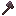
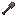
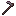

# Netherite Tier
Netherite tier is a [material tier](../material_tiers/list.md), that refers to the collection of tool and armor piece [items](../items.md) made from [Netherite Ingots](../items/netherite_ingot.md).
It is stronger than [Diamond Tier](../material_tiers/diamond_tier.md) and the highest tier in Ultra Hardcore.
> Netherite gear cannot be upgraded in the smithing table.

The items can (only) be obtained by upgrading a [diamond item](../material_tiers/diamond_tier.md) in the [Nether Forge](../blocks/nether_forge.md). If the diamond item has any enchantments, the upgraded diamond item will have them as well.

Similarly to [blaze gold items](../material_tiers/blaze_gold_tier.md), the netherite items will **repair** themselves when the player is on fire while wearing the armor or holding the tools in their main hand or offhand. The items cannot be repaired in a forge.

The attack speed of the Netherite Sword has been increased from 1.6 to 1.2.

| Netherite Sword                                                                                                                                                   | Netherite Pickaxe                                                                                                                                                     | Netherite Axe                                                                                                                                                 | Netherite Shovel                                                                                                                                                    | Netherite Hoe                                                                                                                                                 |
| ----------------------------------------------------------------------------------------------------------------------------------------------------------------- | --------------------------------------------------------------------------------------------------------------------------------------------------------------------- | ------------------------------------------------------------------------------------------------------------------------------------------------------------- | ------------------------------------------------------------------------------------------------------------------------------------------------------------------- | ------------------------------------------------------------------------------------------------------------------------------------------------------------- |
| 
      
 | 
      
 | 
      
 | 
      
 | 
      
 |
| Durability: 2031                                                                                                                                                  | Durability: 2031                                                                                                                                                      | Durability: 2031                                                                                                                                              | Durability: 2031                                                                                                                                                    | Durability: 2031                                                                                                                                              |

| Diamond Helmet                                                                                                                                                      | Diamond Chestplate                                                                                                                                                          | Diamond Leggings                                                                                                                                                        | Diamond Boots                                                                                                                                                     |
| ------------------------------------------------------------------------------------------------------------------------------------------------------------------- | --------------------------------------------------------------------------------------------------------------------------------------------------------------------------- | ----------------------------------------------------------------------------------------------------------------------------------------------------------------------- | ----------------------------------------------------------------------------------------------------------------------------------------------------------------- |
| 
      
 | 
      
 | 
      
 | 
      
 |
| Durability: 407                                                                                                                                                     | Durability: 592                                                                                                                                                             | Durability: 555                                                                                                                                                         | Durability: 481                                                                                                                                                   |
| Armor: 3                                                                                                                                                            | Armor: 8                                                                                                                                                                    | Armor: 6                                                                                                                                                                | Armor: 3                                                                                                                                                          |
| Armor Toughness: 5                                                                                                                                                  | Armor Toughness: 5                                                                                                                                                          | Armor Toughness: 5                                                                                                                                                      | Armor Toughness: 5                                                                                                                                                |

### Obtaining
Netherite Axe:

<table style="border-collapse: collapse; text-align: center; border: 2px solid #3a3a3a;">  
<!-- MERGED HEADER-->  
<tr>  
<th colspan="3" style="border: 2px solid #3a3a3a; background-color: #3a3a3a; color: white; padding: 6px; text-align: center;">Forging Recipe</th>  
</tr>  
<!-- ROW 1 -->  
<tr>  
<td style="border: 1px solid #aaa;"> </td>  
<td style="border: 1px solid #aaa;">Netherite Ingot</td>  
<td style="border: 1px solid #aaa;"> </td>  
</tr>  
<!-- ROW 2 -->  
<tr>  
<td style="border: 1px solid #aaa;"></td>  
<td style="border: 1px solid #aaa;">Diamond Axe</td>  
<td style="border: 1px solid #aaa;"></td>  
</tr>  
<!-- ROW 3 -->  
<tr>  
<td style="border: 1px solid #aaa;"></td>  
<td style="border: 1px solid #aaa;">Netherite Upgrade Smithing Template</td>  
<td style="border: 1px solid #aaa;"></td>  
</tr>  
</table>

Netherite Pickaxe:

<table style="border-collapse: collapse; text-align: center; border: 2px solid #3a3a3a;">  
<!-- MERGED HEADER-->  
<tr>  
<th colspan="3" style="border: 2px solid #3a3a3a; background-color: #3a3a3a; color: white; padding: 6px; text-align: center;">Forging Recipe</th>  
</tr>  
<!-- ROW 1 -->  
<tr>  
<td style="border: 1px solid #aaa;"> </td>  
<td style="border: 1px solid #aaa;">Netherite Ingot</td>  
<td style="border: 1px solid #aaa;"> </td>  
</tr>  
<!-- ROW 2 -->  
<tr>  
<td style="border: 1px solid #aaa;"></td>  
<td style="border: 1px solid #aaa;">Diamond Pickaxe</td>  
<td style="border: 1px solid #aaa;"></td>  
</tr>  
<!-- ROW 3 -->  
<tr>  
<td style="border: 1px solid #aaa;"></td>  
<td style="border: 1px solid #aaa;">Netherite Upgrade Smithing Template</td>  
<td style="border: 1px solid #aaa;"></td>  
</tr>  
</table>

Netherite Hoe:

<table style="border-collapse: collapse; text-align: center; border: 2px solid #3a3a3a;">  
<!-- MERGED HEADER-->  
<tr>  
<th colspan="3" style="border: 2px solid #3a3a3a; background-color: #3a3a3a; color: white; padding: 6px; text-align: center;">Forging Recipe</th>  
</tr>  
<!-- ROW 1 -->  
<tr>  
<td style="border: 1px solid #aaa;"> </td>  
<td style="border: 1px solid #aaa;">Netherite Ingot</td>  
<td style="border: 1px solid #aaa;"> </td>  
</tr>  
<!-- ROW 2 -->  
<tr>  
<td style="border: 1px solid #aaa;"></td>  
<td style="border: 1px solid #aaa;">Diamond Hoe</td>  
<td style="border: 1px solid #aaa;"></td>  
</tr>  
<!-- ROW 3 -->  
<tr>  
<td style="border: 1px solid #aaa;"></td>  
<td style="border: 1px solid #aaa;">Netherite Upgrade Smithing Template</td>  
<td style="border: 1px solid #aaa;"></td>  
</tr>  
</table>

Netherite Shovel:

<table style="border-collapse: collapse; text-align: center; border: 2px solid #3a3a3a;">  
<!-- MERGED HEADER-->  
<tr>  
<th colspan="3" style="border: 2px solid #3a3a3a; background-color: #3a3a3a; color: white; padding: 6px; text-align: center;">Forging Recipe</th>  
</tr>  
<!-- ROW 1 -->  
<tr>  
<td style="border: 1px solid #aaa;"> </td>  
<td style="border: 1px solid #aaa;">Netherite Ingot</td>  
<td style="border: 1px solid #aaa;"> </td>  
</tr>  
<!-- ROW 2 -->  
<tr>  
<td style="border: 1px solid #aaa;"></td>  
<td style="border: 1px solid #aaa;">Diamond Shovel</td>  
<td style="border: 1px solid #aaa;"></td>  
</tr>  
<!-- ROW 3 -->  
<tr>  
<td style="border: 1px solid #aaa;"></td>  
<td style="border: 1px solid #aaa;">Netherite Upgrade Smithing Template</td>  
<td style="border: 1px solid #aaa;"></td>  
</tr>  
</table>

Netherite Sword:

<table style="border-collapse: collapse; text-align: center; border: 2px solid #3a3a3a;">  
<!-- MERGED HEADER-->  
<tr>  
<th colspan="3" style="border: 2px solid #3a3a3a; background-color: #3a3a3a; color: white; padding: 6px; text-align: center;">Forging Recipe</th>  
</tr>  
<!-- ROW 1 -->  
<tr>  
<td style="border: 1px solid #aaa;"> </td>  
<td style="border: 1px solid #aaa;">Netherite Ingot</td>  
<td style="border: 1px solid #aaa;"> </td>  
</tr>  
<!-- ROW 2 -->  
<tr>  
<td style="border: 1px solid #aaa;"></td>  
<td style="border: 1px solid #aaa;">Diamond Sword</td>  
<td style="border: 1px solid #aaa;"></td>  
</tr>  
<!-- ROW 3 -->  
<tr>  
<td style="border: 1px solid #aaa;"></td>  
<td style="border: 1px solid #aaa;">Netherite Upgrade Smithing Template</td>  
<td style="border: 1px solid #aaa;"></td>  
</tr>  
</table>

Netherite Helmet:

<table style="border-collapse: collapse; text-align: center; border: 2px solid #3a3a3a;">  
<!-- MERGED HEADER-->  
<tr>  
<th colspan="3" style="border: 2px solid #3a3a3a; background-color: #3a3a3a; color: white; padding: 6px; text-align: center;">Forging Recipe</th>  
</tr>  
<!-- ROW 1 -->  
<tr>  
<td style="border: 1px solid #aaa;"> </td>  
<td style="border: 1px solid #aaa;">Netherite Ingot</td>  
<td style="border: 1px solid #aaa;"> </td>  
</tr>  
<!-- ROW 2 -->  
<tr>  
<td style="border: 1px solid #aaa;"></td>  
<td style="border: 1px solid #aaa;">Diamond Helmet</td>  
<td style="border: 1px solid #aaa;"></td>  
</tr>  
<!-- ROW 3 -->  
<tr>  
<td style="border: 1px solid #aaa;"></td>  
<td style="border: 1px solid #aaa;">Netherite Upgrade Smithing Template</td>  
<td style="border: 1px solid #aaa;"></td>  
</tr>  
</table>

Netherite Chestplate:

<table style="border-collapse: collapse; text-align: center; border: 2px solid #3a3a3a;">  
<!-- MERGED HEADER-->  
<tr>  
<th colspan="3" style="border: 2px solid #3a3a3a; background-color: #3a3a3a; color: white; padding: 6px; text-align: center;">Forging Recipe</th>  
</tr>  
<!-- ROW 1 -->  
<tr>  
<td style="border: 1px solid #aaa;"> </td>  
<td style="border: 1px solid #aaa;">Netherite Ingot</td>  
<td style="border: 1px solid #aaa;"> </td>  
</tr>  
<!-- ROW 2 -->  
<tr>  
<td style="border: 1px solid #aaa;"></td>  
<td style="border: 1px solid #aaa;">Diamond Chestplate</td>  
<td style="border: 1px solid #aaa;"></td>  
</tr>  
<!-- ROW 3 -->  
<tr>  
<td style="border: 1px solid #aaa;"></td>  
<td style="border: 1px solid #aaa;">Netherite Upgrade Smithing Template</td>  
<td style="border: 1px solid #aaa;"></td>  
</tr>  
</table>

Netherite Leggings:

<table style="border-collapse: collapse; text-align: center; border: 2px solid #3a3a3a;">  
<!-- MERGED HEADER-->  
<tr>  
<th colspan="3" style="border: 2px solid #3a3a3a; background-color: #3a3a3a; color: white; padding: 6px; text-align: center;">Forging Recipe</th>  
</tr>  
<!-- ROW 1 -->  
<tr>  
<td style="border: 1px solid #aaa;"> </td>  
<td style="border: 1px solid #aaa;">Netherite Ingot</td>  
<td style="border: 1px solid #aaa;"> </td>  
</tr>  
<!-- ROW 2 -->  
<tr>  
<td style="border: 1px solid #aaa;"></td>  
<td style="border: 1px solid #aaa;">Diamond Leggings</td>  
<td style="border: 1px solid #aaa;"></td>  
</tr>  
<!-- ROW 3 -->  
<tr>  
<td style="border: 1px solid #aaa;"></td>  
<td style="border: 1px solid #aaa;">Netherite Upgrade Smithing Template</td>  
<td style="border: 1px solid #aaa;"></td>  
</tr>  
</table>

Netherite Boots:

<table style="border-collapse: collapse; text-align: center; border: 2px solid #3a3a3a;">  
<!-- MERGED HEADER-->  
<tr>  
<th colspan="3" style="border: 2px solid #3a3a3a; background-color: #3a3a3a; color: white; padding: 6px; text-align: center;">Forging Recipe</th>  
</tr>  
<!-- ROW 1 -->  
<tr>  
<td style="border: 1px solid #aaa;"> </td>  
<td style="border: 1px solid #aaa;">Netherite Ingot</td>  
<td style="border: 1px solid #aaa;"> </td>  
</tr>  
<!-- ROW 2 -->  
<tr>  
<td style="border: 1px solid #aaa;"></td>  
<td style="border: 1px solid #aaa;">Diamond Boots</td>  
<td style="border: 1px solid #aaa;"></td>  
</tr>  
<!-- ROW 3 -->  
<tr>  
<td style="border: 1px solid #aaa;"></td>  
<td style="border: 1px solid #aaa;">Netherite Upgrade Smithing Template</td>  
<td style="border: 1px solid #aaa;"></td>  
</tr>  
</table>

