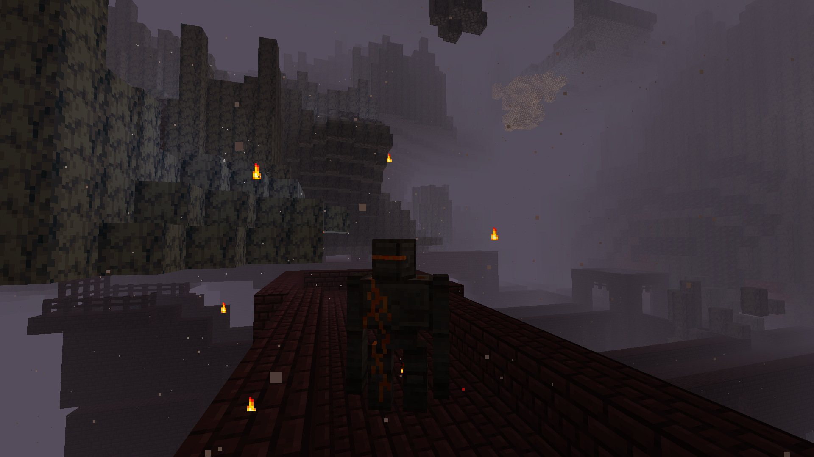

# Nether Golem
Nether Golems are hostile [mobs](../mobs.md) which can spawn in Nether Fortressess. They are the only source of Nether Cores, making them a renewable source for Netherite Ingots.

| 
      
 |
| --------------------------------------------------------------------------------------------------------------------------------------- |

They are retextured Iron Golems and replace 5% of Wither Skeleton spawns.

Drops:
- 0 to 2 nether cores
- 0 to 2 nether bricks