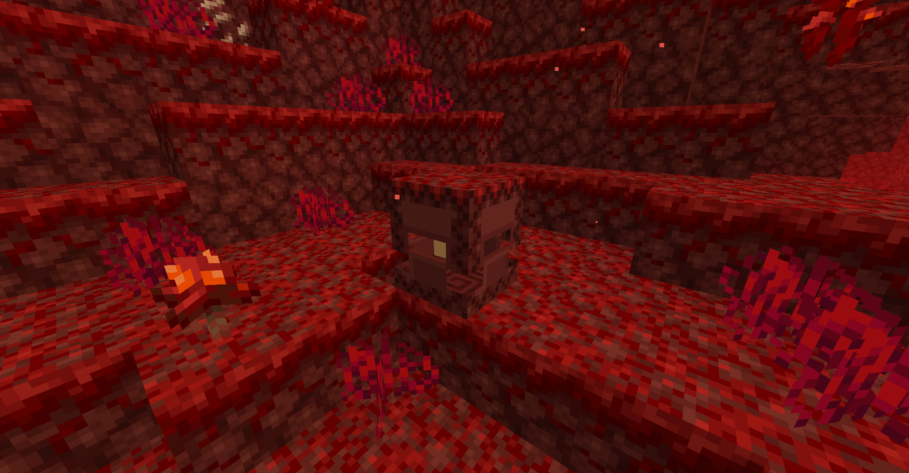
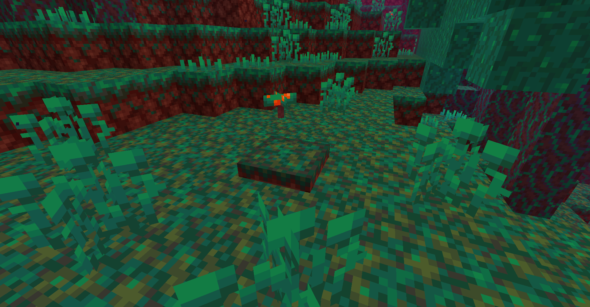
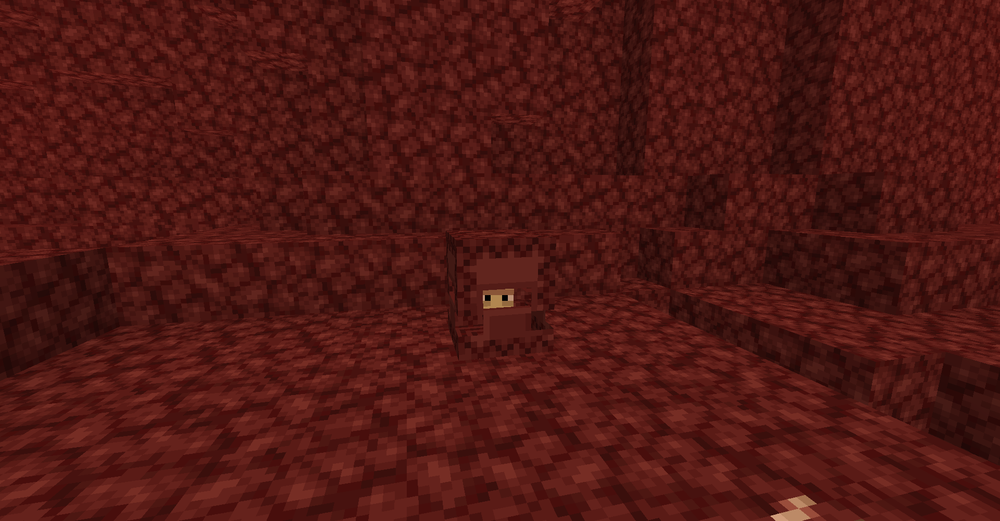

# Nether Shulker
Nether Shulkers are hostile [mobs](../mobs.md) which spawn in the nether. Their textures closely resemble netherrack, warped nylium or crimson nylium helping them blend into the environment. They are a renewable source of netherrack.

| 
      
 | 
      
 | 
      
 |
| --------------------------------------------------------------------------------------------------------------------------------------------- | ------------------------------------------------------------------------------------------------------------------------------------------- | ------------------------------------------------------------------------------------------------------------------------------------------- |

They teleport and shoot projectiles which follow the player like the shulker does. If the projectile hits a player, they will gain an anti-levitation effect (making them unable to jump) and set fire to the block they're standing on.

They are retextured Shulkers and replace 5% of Piglin spawns.

If a Nether Shulker spawns on netherrack, warped nylium or crimson nylium they will replace the block (and spawn flush with the floor). Their texture is determined by the replaced block and resembles netherrack by default.

Drops:
- 0-1 Netherrack
- 0-3 Gold nuggets