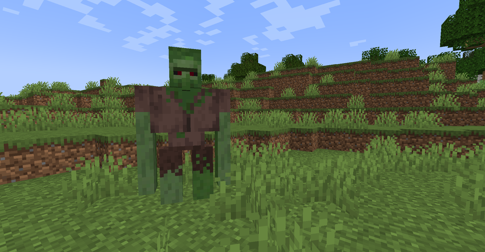

# Zombie Brute
Zombie Brutes are hostile [mobs](../mobs.md) that spawn in the overworld. They are the only source of [Brute Tears](../items/brute_tear.md), which are required to [forge](../miscellaneous/forges.md) [Diamond Ingots](../items/diamond_ingot.md).

| 
      
 |
| --------------------------------------------------------------------------------------------------------------------------------------- |

They are retextured Iron Golems that replace a portion of Zombie spawns. They have a much higher chance of spawning during a [Red Moon](../miscellaneous/red_moon.md).

A zombie villager will turn into a Zombie Brute during a [Red Moon](../miscellaneous/red_moon.md).

Drop:
- 2 to 5 Rotten Flesh
- Potato (~30% chance)
- Carrot (~30% chance) 
- Beetroot (~30% chance)
- Iron ingot (~30% chance)
- [Brute tear](../items/brute_tear.md) (~30% chance)

